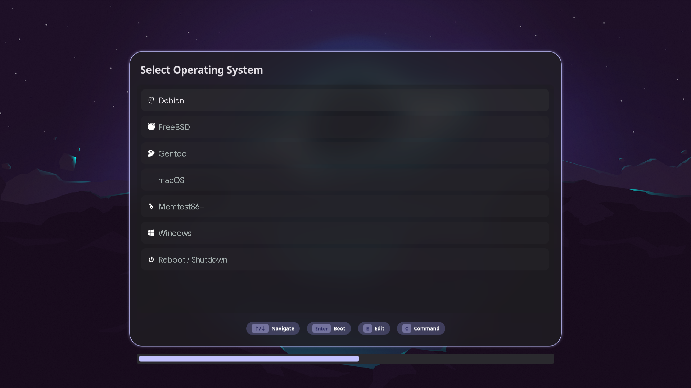

# Caelestia GRUB Theme

A dynamic, GRUB2 theme built for Caelestia. It automatically syncs its layout, colors, and 9-slice UI elements with your current Caelestia tokens, scheme, and wallpaper.



## Installation

This theme is designed to be installed easily using `pkgit`.

```bash
pkgit -i https://github.com/dim-ghub/Caelestia-Grub
```

The installation script will automatically generate the required 9-slice assets, configure the theme, and update your system's GRUB config to apply it seamlessly.
